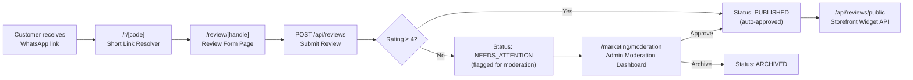

# Stitched Admin Portal — Complete Features Documentation

> **Stitched** is a premium abaya fashion brand based in Qatar. This Next.js admin portal manages orders, customers, finances, marketing, and product reviews.

---

## Table of Contents

1. [Dashboard](#1-dashboard)
2. [Customer Management](#2-customer-management)
3. [Finance Module](#3-finance-module)
4. [Marketing — WhatsApp Campaigns](#4-marketing--whatsapp-campaigns)
5. [⭐ Reviews System (New Feature)](#5--reviews-system-new-feature)
6. [Settings](#6-settings)
7. [Shopify Webhook Integration](#7-shopify-webhook-integration)
8. [Authentication & Role-Based Access](#8-authentication--role-based-access)
9. [Internationalization (i18n)](#9-internationalization-i18n)

---

## 1. Dashboard

**Route:** `/dashboard`  
**File:** [page.tsx](file:///Users/alaa/Documents/Stitched/Google/abaya_portal_admin/app/(dashboard)/dashboard/page.tsx)

| KPI Card       | Data Source                          |
|----------------|--------------------------------------|
| Total Revenue  | Sum of `total_amount_minor + total_shipping_minor` for paid/completed/shipped/partially_paid orders |
| Total Orders   | Count of qualifying orders           |
| Total Customers| Count of all `customers` records     |

- Displays **5 most recent orders** with status badges (Paid, Deposit, Pending)
- **Deposit orders** show paid amount, remaining balance, and a purple "Deposit" badge
- Floating Quick Actions button (FAB) for common tasks
- Fully bilingual (EN/AR) via dictionary system

---

## 2. Customer Management

**Route:** `/customers` → `/customers/[id]`  
**Key Files:**
- [customers/page.tsx](file:///Users/alaa/Documents/Stitched/Google/abaya_portal_admin/app/(dashboard)/customers/page.tsx)
- [customers/[id]/page.tsx](file:///Users/alaa/Documents/Stitched/Google/abaya_portal_admin/app/(dashboard)/customers/%5Bid%5D/page.tsx)

### Features
- **Customer List** — searchable by name, phone, or email
- **Customer Detail Page** — tabbed interface with:
  - **Overview** — contact info, stats, lifetime value
  - **Measurements** — standard sizes (XS–3XL) and custom body measurements (8 fields in cm)
  - **Orders** — full order history with line items
- **Loyalty Tiers** — dynamically calculated from lifetime spend; configured in Settings
- **Deposit Tracking** — flags customers with active `partially_paid` orders
- **Actions** — Add Order, Delete Customer, Edit

---

## 3. Finance Module

**Route:** `/finance` | `/finance/orders` | `/finance/expenses`

### Finance Dashboard ([page.tsx](file:///Users/alaa/Documents/Stitched/Google/abaya_portal_admin/app/(dashboard)/finance/page.tsx))
- **Period Selector** — filter by Month, Quarter, Year, or All Time
- **7 KPI Cards** — Revenue, Net Profit, Expenses, Orders, Deposit Orders, AOV, Margin
- **Period-over-period comparison** with % change indicators
- **Charts** — P&L line chart, revenue by source pie, fully paid vs deposit pie, revenue trend area chart
- **Top Products List** — best-selling products for the period
- **Export** — Excel (multi-sheet) and PDF summary reports

### Order History ([orders/page.tsx](file:///Users/alaa/Documents/Stitched/Google/abaya_portal_admin/app/(dashboard)/finance/orders/page.tsx))
- Full order list with search, status filter (All/Paid/Deposit/Completed/Pending/Cancelled), and sort by date or amount
- Expandable order cards showing line items, customer link, shipping breakdown

### Expenses ([expenses/page.tsx](file:///Users/alaa/Documents/Stitched/Google/abaya_portal_admin/app/(dashboard)/finance/expenses/page.tsx))
- Expense logging with category, description, amount, date, and attachment support
- Modal form for creating new expenses

---

## 4. Marketing — WhatsApp Campaigns

**Route:** `/marketing`  
**File:** [marketing/page.tsx](file:///Users/alaa/Documents/Stitched/Google/abaya_portal_admin/app/(dashboard)/marketing/page.tsx)

### How It Works
1. **Audience Selection** — search/filter customers by name, phone, or loyalty tier; select all or individual
2. **Campaign Configuration** — choose a WhatsApp template name, language code (AR/EN), header image URL, body variables (`{{1}}`, `{{2}}`…), and button URL variables
3. **Review & Send** — preview the message, validate all variables, then batch-send via Meta Business API

### Key Features
- **Template History** — recently used templates auto-saved to localStorage with their variable configurations
- **Auto-load configs** — selecting a saved template pre-fills variable count and language
- **URL Auto-extraction** — pasting full URLs into button variables automatically extracts the suffix
- **Mobile Wizard** — 3-step wizard (Audience → Campaign → Review) for mobile users
- **Live Preview** — real-time preview of the message being constructed
- **Send Logs** — per-customer success/error status after campaign dispatch

---

## 5. ⭐ Reviews System (New Feature)

> [!IMPORTANT]
> This is the major new feature. It spans a customer-facing review form, admin moderation dashboard, short link system, public storefront API, and review link generator.

### Architecture Overview



### 5.1 Customer Review Form

**Route:** `/review/[handle]`  
**File:** [review/[handle]/page.tsx](file:///Users/alaa/Documents/Stitched/Google/abaya_portal_admin/app/review/%5Bhandle%5D/page.tsx)

- **Public page** — no authentication required; accessible by customers
- **Product lookup** via Shopify GraphQL API (`/api/reviews/product/[handle]`)
- **Premium dark UI** — radial gradient background, glass-morphism inputs, serif typography
- **Bilingual** — EN/AR toggle with localStorage persistence
- **Heart Rating** (1-5) with creative labels:
  - 1 ★ → "Not This Time"  |  5 ★ → "Stole My Heart ♡"
- **Optional fields** — review text (500 char max), customer name, WhatsApp number
- **Personalized links** — URL params `?n=` and `?p=` (base64-encoded) pre-fill name and phone
- **Phone normalization** — auto-detects Gulf country codes (+974, +971, +966…)
- **Thank You page** — animated falling stitching icons (✂️🧵🪡🧷), pulsing heart, link to Stitched website

### 5.2 Short Link System

**Route:** `/r/[code]` → redirects to `/review/[handle]?n=...&p=...`

| Component | File |
|-----------|------|
| Resolver | [r/[code]/route.ts](file:///Users/alaa/Documents/Stitched/Google/abaya_portal_admin/app/r/%5Bcode%5D/route.ts) |
| Creator API | [api/review-links/route.ts](file:///Users/alaa/Documents/Stitched/Google/abaya_portal_admin/app/api/review-links/route.ts) |

**How it works:**
1. Admin generates a short link via `POST /api/review-links` with `{ productHandle, customerName?, customerWhatsapp? }`
2. API creates a 7-character alphanumeric code in `review_short_links` table (collision-resistant, 5 retries)
3. Short URL like `stitchedqa.com/r/abc1234` is sent via WhatsApp
4. Customer clicks → `/r/[code]` resolves the code, builds the full review URL with encoded customer params, and 302-redirects

### 5.3 Review Submission API

**Route:** `POST /api/reviews`  
**File:** [api/reviews/route.ts](file:///Users/alaa/Documents/Stitched/Google/abaya_portal_admin/app/api/reviews/route.ts)

**Auto-Triage Logic:**
| Rating | Status | Behavior |
|--------|--------|----------|
| 4–5 ★  | `PUBLISHED` | Auto-approved, immediately visible on storefront |
| 1–3 ★  | `NEEDS_ATTENTION` | Flagged for admin moderation |

**Additional endpoints:**
- `GET /api/reviews` — fetch all non-archived reviews (moderation dashboard)
- `DELETE /api/reviews` — bulk delete all reviews (admin/test use)

### 5.4 Review Moderation

**Route:** `/marketing/moderation`  
**Component:** `ReviewModerationDashboard`

**Status transitions** via `PATCH /api/reviews/[id]`:
- `NEEDS_ATTENTION` → `PUBLISHED` (approve)
- `NEEDS_ATTENTION` → `ARCHIVED` (archive/dismiss)
- `PUBLISHED` → `NEEDS_ATTENTION` (revoke approval)

### 5.5 Review Link Generator & Send to Customer

**Route:** `/marketing/reviews`  
**Component:** [ReviewLinkGenerator.tsx](file:///Users/alaa/Documents/Stitched/Google/abaya_portal_admin/components/marketing/ReviewLinkGenerator.tsx)

Admin tool for managing review links. Displays all Shopify products in a paginated grid with product image, title, and live rating stats (from `/api/reviews/stats`).

**Per-product actions:**
- **"Send to Customer" button** — opens a bottom-sheet modal where you search for a customer by name/phone, then send them a personalized review link directly via WhatsApp in **English** or **Arabic**
- **Copy segmented control** — one-tap copy of:
  - 🔗 **Link** — bare review URL
  - 💬 **EN** — full branded English WhatsApp message with the link
  - 🌐 **AR** — full branded Arabic WhatsApp message with the link

**Send to Customer flow:**
1. Click "Send to Customer" on any product
2. Modal opens → search customers by name, phone, or order
3. Each customer row shows **EN** and **AR** send buttons
4. Clicking a button creates a personalized short link (via `/api/review-links`) and opens WhatsApp Web/app with the pre-written branded message
5. Confirmation toast appears after sending

### 5.6 Send Review via WhatsApp from Customer Details Page

**Route:** `/customers/[id]` → Orders tab  
**Component:** [OrderHistory.tsx](file:///Users/alaa/Documents/Stitched/Google/abaya_portal_admin/components/customers/OrderHistory.tsx)

> [!TIP]
> This is the fastest way to request a review — directly from the customer's order history.

Each order card in the Customer Details page has a **"Send Review Link"** button at the bottom. The flow:

1. Expand any order in the customer's order history
2. Click **"Send Review Link"**
3. Choose language: **English** or **Arabic**
4. The system automatically:
   - Resolves each order item's product name → Shopify handle (via `/api/admin/products/resolve-handles`)
   - Creates personalized short links for **every product** in the order (via `/api/review-links`), embedding the customer's name and phone
   - Builds a branded WhatsApp message listing all products with their individual review links
   - Opens WhatsApp directly with the message pre-filled and the customer's phone number
5. A green **"Opened in WhatsApp"** confirmation appears

**Multi-product support:** if an order contains multiple items, the message includes a separate review link for each product:
```
✦ *Product A* → reviews.stitchedqa.com/r/abc1234
✦ *Product B* → reviews.stitchedqa.com/r/xyz5678
```

### 5.7 Public Storefront API

**Route:** `GET /api/reviews/public?handle={productHandle}`  
**File:** [api/reviews/public/route.ts](file:///Users/alaa/Documents/Stitched/Google/abaya_portal_admin/app/api/reviews/public/route.ts)

- **CORS-enabled** — callable from any Shopify theme
- **Cached** — `s-maxage=60, stale-while-revalidate=120`
- **Privacy-safe** — returns first name only, no phone numbers
- **Returns:** average rating, count, star distribution, and review list

### 5.8 Review Stats API

**Route:** `GET /api/reviews/stats`  
**File:** [api/reviews/stats/route.ts](file:///Users/alaa/Documents/Stitched/Google/abaya_portal_admin/app/api/reviews/stats/route.ts)

Returns per-product rating aggregation (avg, count, distribution by star) from `PUBLISHED` reviews only. Used by the admin review link generator to show rating badges.

### Database Tables

| Table | Purpose |
|-------|---------|
| `reviews` | Stores all reviews with `product_handle`, `rating`, `review_text`, `customer_name`, `customer_whatsapp`, `status` (PUBLISHED/NEEDS_ATTENTION/ARCHIVED) |
| `review_short_links` | Maps short codes to `product_handle` + customer params + language |

---

## 6. Settings

**Route:** `/settings/general` | `/settings/team`

### General Settings ([general/page.tsx](file:///Users/alaa/Documents/Stitched/Google/abaya_portal_admin/app/(dashboard)/settings/general/page.tsx))
- **Appearance** — theme selector with multiple color schemes
- **Loyalty Tiers** — CRUD for loyalty tiers (name, minimum spend in QAR, color); changes auto-recalculate all customer tiers

### Team Management ([team/page.tsx](file:///Users/alaa/Documents/Stitched/Google/abaya_portal_admin/app/(dashboard)/settings/team/page.tsx))
- **User Management** — list, invite, edit display name, change role, enable/disable, delete
- **5 Roles:** Owner → Admin → Manager → Moderator → Viewer
- **Role-based permissions** — higher roles can only manage lower roles
- **Invite via email** — modal with role selection
- **Activity/Audit Log** — expandable log of team management actions

---

## 7. Shopify Webhook Integration

**Route:** `POST /api/webhooks/shopify`  
**File:** [api/webhooks/shopify/route.ts](file:///Users/alaa/Documents/Stitched/Google/abaya_portal_admin/app/api/webhooks/shopify/route.ts)

| Feature | Implementation |
|---------|---------------|
| HMAC Verification | Validates `x-shopify-hmac-sha256` header |
| Idempotency | Payload hash stored in `webhook_events`; duplicate detection |
| Structured Logging | JSON logs with `trace_id` |
| Retry Prevention | Always returns 200 to avoid Shopify retry storms |

**Supported Topics:** `checkouts/create`, `checkouts/update`, `orders/create`, `orders/paid`, `orders/cancelled`, `refunds/create`, `customers/create`, `customers/update`

---

## 8. Authentication & Role-Based Access

**File:** [middleware.ts](file:///Users/alaa/Documents/Stitched/Google/abaya_portal_admin/middleware.ts)

- **Supabase Auth** — session refresh with 5s timeout to prevent hanging
- **Public Routes:** `/login`, `/forgot-password`, `/reset-password`, `/auth/callback`, `/api/webhooks`, `/review/*`, `/api/reviews/*`
- **Moderator Restriction** — moderators can only access `/marketing/reviews`, `/marketing/moderation`, and `/customers`; all other routes redirect to `/marketing/reviews`
- **Root redirect** — authenticated users on `/` → `/dashboard`

---

## 9. Internationalization (i18n)

- Full **Arabic (AR)** and **English (EN)** support via dictionary files in `/locales`
- Language stored in `NEXT_LOCALE` cookie
- RTL layout support with `dir="rtl"` and directional CSS utilities
- Review form has its own independent language toggle with localStorage persistence

---

## Tech Stack

| Layer | Technology |
|-------|-----------|
| Framework | Next.js (App Router) |
| Database | Supabase (PostgreSQL) |
| Auth | Supabase Auth |
| E-commerce | Shopify (GraphQL Admin API + Webhooks) |
| Messaging | WhatsApp Business API (Meta) |
| Styling | Tailwind CSS + custom CSS variables (theme system) |
| Export | xlsx, jsPDF |
| Icons | Lucide React |
